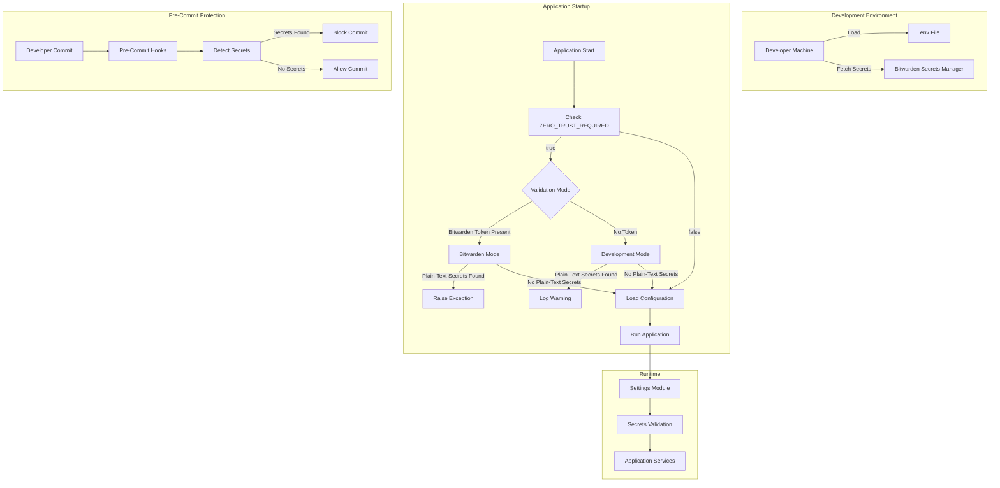
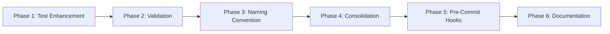

# Secrets Management and Environment Configuration Security Plan

## Executive Summary

This plan implements a comprehensive secrets management framework for the InGest-LLM project, addressing security vulnerabilities, enforcing Bitwarden-only secret storage, standardizing environment variable naming, consolidating configuration files, and implementing pre-commit secret detection.

## Current State Analysis

### Identified Issues
1. **Test file uses environment variables correctly** - [`ingest-llm/test_integration.py`](ingest-llm/test_integration.py:12-15) already checks for `POSTGRES_DSN` and `LINEAR_WEBHOOK_SECRET` from environment
2. **Multiple .env files exist** - Both root `.env` and `ingest-llm/.env` present, creating configuration drift risk
3. **Inconsistent naming convention** - Some variables use `INGEST_` prefix while others don't (e.g., `POSTGRES_DSN`, `LINEAR_WEBHOOK_SECRET`)
4. **Pre-commit hooks exist but need enhancement** - Current `.pre-commit-config.yaml` has basic detect-secrets but needs gitleaks integration
5. **No startup validation** - Application doesn't validate for plain-text secrets when Bitwarden mode is enabled

### Existing Security Infrastructure
- `.env.example` - Template with both Bitwarden and legacy modes
- `.env.secure_template` - Bitwarden-only template with `ZERO_TRUST_REQUIRED=true`
- `.gitignore` - Properly blocks `.env` files except templates
- `.pre-commit-config.yaml` - Basic detect-secrets hook configured

## Architecture Overview



## Phase 1: Verify and Enhance Test File Environment Variable Usage

### Objective
Ensure test files use environment variables properly and work seamlessly with Bitwarden integration.

### Tasks

#### 1.1 Verify ingest-llm/test_integration.py uses environment variables correctly
- **Current State**: File already checks for `POSTGRES_DSN` and `LINEAR_WEBHOOK_SECRET` in `os.environ`
- **Action**: Verify no hardcoded values exist, confirm error messages are clear
- **Files**: [`ingest-llm/test_integration.py`](ingest-llm/test_integration.py:12-15)

#### 1.2 Create pytest fixtures for test secrets
- **Action**: Create `conftest.py` in `ingest-llm/tests/` directory
- **Fixtures to create**:
  - `postgres_dsn()` - Provides test PostgreSQL connection string
  - `linear_webhook_secret()` - Provides test webhook secret
  - `test_env()` - Sets up test environment variables
- **Benefits**: Reusable fixtures, easier test maintenance, consistent test data

#### 1.3 Update test file to use pytest fixtures
- **Action**: Refactor [`ingest-llm/test_integration.py`](ingest-llm/test_integration.py:12-15) to use fixtures
- **Changes**:
  - Remove direct `os.environ` checks
  - Use `@pytest.fixture` decorated functions
  - Add fixture parameters to test functions
- **Result**: More maintainable and testable code

#### 1.4 Create .env.test file with test-specific configuration
- **Action**: Create `ingest-llm/.env.test` file
- **Content**: Test-specific values for `POSTGRES_DSN` and `LINEAR_WEBHOOK_SECRET`
- **Gitignore**: Ensure `.env.test` is added to `.gitignore`
- **Usage**: Load via `pytest-dotenv` plugin or manual environment setup

#### 1.5 Run test suite to verify all tests pass
- **Action**: Execute `pytest ingest-llm/` with new configuration
- **Verification**: All tests pass without errors
- **Command**: `pytest ingest-llm/ -v --envfile=ingest-llm/.env.test`

## Phase 2: Implement Bitwarden-Only Secret Storage Validation

### Objective
Create validation mechanism that detects and rejects plain-text secrets when Bitwarden mode is enabled.

### Tasks

#### 2.1 Create secrets validation module
- **Action**: Create `src/ingest_llm_as/security/__init__.py`
- **Module**: `src/ingest_llm_as/security/validator.py`
- **Functions**:
  - `validate_no_plain_text_secrets()` - Scans environment for plain-text secrets
  - `is_bitwarden_enabled()` - Checks if Bitwarden mode is active
  - `get_secret_patterns()` - Returns regex patterns for common secret formats
- **Patterns to detect**:
  - API keys (sk-, pk_, api_key, API_KEY)
  - Passwords (password, PASSWORD, secret, SECRET)
  - Tokens (token, TOKEN, jwt, JWT)
  - Database connection strings with credentials

#### 2.2 Implement startup validation function
- **Action**: Implement validation logic in `validator.py`
- **Logic**:
  ```python
  def validate_no_plain_text_secrets(settings: Settings) -> List[str]:
      violations = []
      if settings.zero_trust_required and settings.bws_access_token:
          # Check for plain-text secrets when Bitwarden is enabled
          for var_name, var_value in os.environ.items():
              if is_secret_variable(var_name) and has_plain_text_secret(var_value):
                  violations.append(f"Plain-text secret found: {var_name}")
      return violations
  ```
- **Behavior**:
  - Returns list of violations
  - Empty list means no issues found

#### 2.3 Add ZERO_TRUST_REQUIRED flag to Settings class
- **Action**: Update [`src/ingest_llm_as/config.py`](src/ingest_llm_as/config.py:17)
- **Add field**:
  ```python
  zero_trust_required: bool = Field(
      default=False,
      description="Enforce Bitwarden-only secret storage"
  )
  bws_access_token: Optional[str] = Field(
      default=None,
      description="Bitwarden Secrets Manager access token"
  )
  ```
- **Integration**: Works with existing `env_prefix="INGEST_"` convention

#### 2.4 Integrate validation into application startup
- **Action**: Update [`src/ingest_llm_as/main.py`](src/ingest_llm_as/main.py:1)
- **Location**: In `create_app()` or startup event handler
- **Code**:
  ```python
  from ingest_llm_as.security.validator import validate_no_plain_text_secrets

  def validate_startup_config():
      settings = get_settings()
      violations = validate_no_plain_text_secrets(settings)
      if violations:
          handle_violations(settings, violations)

  def handle_violations(settings: Settings, violations: List[str]):
      if settings.app_env == "production":
          raise SecurityError(f"Security violations: {', '.join(violations)}")
      else:
          logger.warning(f"Security warnings: {', '.join(violations)}")
  ```

#### 2.5 Configure warning vs exception behavior based on APP_ENV
- **Action**: Implement environment-aware validation
- **Logic**:
  - `production`: Raise exception, block startup
  - `staging`: Log warning, allow startup
  - `development`: Log warning, allow startup
- **Rationale**: Balance security with developer experience

#### 2.6 Test validation with both Bitwarden mode and development mode
- **Action**: Create unit tests in `tests/test_security_validator.py`
- **Test cases**:
  - Bitwarden mode with plain-text secrets → Exception
  - Bitwarden mode without plain-text secrets → Pass
  - Development mode with plain-text secrets → Warning
  - Development mode without plain-text secrets → Pass
- **Coverage**: All validation paths

## Phase 3: Standardize Environment Variable Naming Convention

### Objective
Ensure all environment variables follow consistent `INGEST_` prefix naming scheme.

### Tasks

#### 3.1 Audit all environment variables in .env.example for INGEST_ prefix
- **Action**: Review [`.env.example`](.env.example:1-211)
- **Variables to check**:
  - `POSTGRES_DSN` → Should be `INGEST_POSTGRES_DSN`
  - `LINEAR_WEBHOOK_SECRET` → Should be `INGEST_LINEAR_WEBHOOK_SECRET`
  - `APP_NAME`, `APP_VERSION`, `APP_ENV` → Should be `INGEST_APP_*`
  - `OBSIDIAN_VAULT_PATH` → Should be `INGEST_OBSIDIAN_VAULT_PATH`
  - `HEARTBEAT_INTERVAL_SEC` → Should be `INGEST_HEARTBEAT_INTERVAL_SEC`
  - `QUIPU_SERVICE_NAME` → Should be `INGEST_QUIPU_SERVICE_NAME`
  - `DEFAULT_CHUNK_SIZE`, `MAX_CONTENT_SIZE`, `MAX_CHUNKS_PER_REQUEST` → Should be `INGEST_*`
  - `NANOGPT_API_KEY`, `OPENROUTER_API_KEY`, `PERPLEXITY_API_KEY_PRD` → Should be `INGEST_*`
  - `TAVILY_API_KEY`, `BRAVE_API_KEY`, `KAGI_API_KEY`, `EXA_API_KEY` → Should be `INGEST_*`
  - `GITHUB_API_KEY`, `JINA_AI_API_KEY`, `FIRECRAWL_API_KEY` → Should be `INGEST_*`
  - `APIDOG_ACCESS_TOKEN`, `APIDOG_PROJECT_ID` → Should be `INGEST_*`

#### 3.2 Update variables without INGEST_ prefix to follow convention
- **Action**: Systematically rename all variables
- **Approach**:
  1. Create mapping of old → new names
  2. Update `.env.example` with new names
  3. Update `.env.secure_template` with new names
  4. Update code references
  5. Update documentation

#### 3.3 Update code references to use standardized variable names
- **Files to update**:
  - [`src/ingest_llm_as/config.py`](src/ingest_llm_as/config.py:1) - Settings class fields
  - [`ingest-llm/ingest_llm/routers/webhook.py`](ingest-llm/ingest_llm/routers/webhook.py:33) - `POSTGRES_DSN`
  - [`ingest-llm/ingest_llm/routers/health.py`](ingest-llm/ingest_llm/routers/health.py:31) - `POSTGRES_DSN`
  - [`ingest-llm/ingest_llm/main.py`](ingest-llm/ingest_llm/main.py:48) - `POSTGRES_DSN`
  - [`ingest-llm/ingest_llm/core/linear_webhook.py`](ingest-llm/ingest_llm/core/linear_webhook.py:97) - `LINEAR_WEBHOOK_SECRET`
  - Test files using `os.getenv()`

#### 3.4 Update .env.example with standardized naming convention
- **Action**: Rewrite [`.env.example`](.env.example:1-211) with `INGEST_` prefix
- **Sections**:
  - Service Identity & Core Settings
  - Security & Webhooks
  - Database (Persistence Layer)
  - memOS Integration
  - Embedding Service (Ollama)
  - Embedding Parameters
  - QuiPU Monitoring
  - Content Processing Limits
  - AI Services
  - Paths
  - Apidog Configuration
  - Omnisearch - Search Providers
  - Omnisearch - AI Response Providers
  - Omnisearch - Content Processing

#### 3.5 Update .env.secure_template with standardized naming
- **Action**: Update [`.env.secure_template`](.env.secure_template:1-140)
- **Changes**:
  - All secret IDs: `INGEST_*_PRD_ID`
  - All configuration: `INGEST_*`
  - Maintain Bitwarden-only structure

#### 3.6 Update documentation to reflect new variable names
- **Files to update**:
  - [`docs/environment-variables-reference.md`](ingest-llm/docs/environment-variables-reference.md)
  - [`docs/docker-compose.README.md`](docs/docker-compose.README.md)
  - [`docs/operational-runbook.md`](ingest-llm/docs/operational-runbook.md)
  - [`README.md`](README.md)
- **Action**: Search and replace old variable names with new ones

## Phase 4: Consolidate Environment Configuration Files

### Objective
Eliminate duplicate .env files to prevent configuration drift and confusion.

### Tasks

#### 4.1 Review all .env files in project
- **Action**: List all `.env*` files
- **Expected files**:
  - `.env` (root)
  - `.env.example` (root)
  - `.env.secure_template` (root)
  - `ingest-llm/.env` (to be removed)
  - `.env.test` (to be created)
- **Command**: `find . -name ".env*" -type f`

#### 4.2 Merge ingest-llm/.env into root .env
- **Action**: Combine configurations
- **Process**:
  1. Read both files
  2. Identify unique variables in `ingest-llm/.env`
  3. Add missing variables to root `.env`
  4. Resolve conflicts (root takes precedence)
  5. Standardize variable names to `INGEST_` prefix

#### 4.3 Delete ingest-llm/.env file
- **Action**: Remove duplicate file
- **Verification**: Ensure no code references `ingest-llm/.env`
- **Command**: `rm ingest-llm/.env`

#### 4.4 Verify .gitignore properly blocks all .env files except templates
- **Action**: Review [`.gitignore`](.gitignore:1-117)
- **Current rules**:
  ```
  .env
  .env.local
  .env.*.local
  .env.secure_template
  !.env.example
  ```
- **Verification**: Ensure `.env.test` is also blocked
- **Add if needed**: `.env.test`

#### 4.5 Update documentation to reference single .env file location
- **Action**: Update all documentation
- **Changes**:
  - Remove references to `ingest-llm/.env`
  - Reference only root `.env`
  - Update setup instructions
  - Update Docker compose references

## Phase 5: Enhance Pre-Commit Secret Detection Hooks

### Objective
Configure pre-commit hooks to scan all changes and block commits containing secrets.

### Tasks

#### 5.1 Install and configure detect-secrets tool
- **Action**: Install detect-secrets
- **Command**: `pip install detect-secrets`
- **Configuration**: Create `.secrets.baseline` file

#### 5.2 Create .secrets.baseline file for existing non-secrets
- **Action**: Generate baseline
- **Command**: `detect-secrets scan --baseline > .secrets.baseline`
- **Purpose**: Mark existing non-secrets as safe to avoid false positives
- **Gitignore**: Add `.secrets.baseline` to `.gitignore`

#### 5.3 Update .pre-commit-config.yaml with enhanced detect-secrets configuration
- **Action**: Update [`.pre-commit-config.yaml`](.pre-commit-config.yaml:1-25)
- **Enhancements**:
  ```yaml
  repos:
    - repo: https://github.com/Yelp/detect-secrets
      rev: v1.4.0
      hooks:
        - id: detect-secrets
          args: ['--baseline', '.secrets.baseline']
          exclude: 'package.lock.json'
  ```
- **Patterns to detect**:
  - AWS Access Keys
  - Generic API Keys
  - Google Cloud Keys
  - GitHub Tokens
  - Slack Tokens
  - Private Keys
  - Database Connection Strings

#### 5.4 Add gitleaks hook as secondary secret detection
- **Action**: Add gitleaks to `.pre-commit-config.yaml`
- **Configuration**:
  ```yaml
  - repo: https://github.com/zricethezav/gitleaks
    rev: v8.18.0
    hooks:
      - id: gitleaks
        args: ['--redact', '--verbose']
  ```
- **Benefits**: Multiple detection engines reduce false negatives

#### 5.5 Configure hooks to block commits with detected secrets
- **Action**: Ensure hooks fail on detection
- **Current state**: Hooks already configured to fail
- **Verification**: Test with sample secret

#### 5.6 Test pre-commit hooks with sample secret patterns
- **Action**: Create test file with secrets
- **Test cases**:
  - File with API key: `sk-or-v1-test-key`
  - File with password: `password: "secret123"`
  - File with token: `token: abc123xyz`
- **Expected**: Pre-commit blocks commit
- **Cleanup**: Remove test file after verification

## Phase 6: Document and Verify Implementation

### Objective
Create comprehensive documentation and verify no secrets remain in codebase.

### Tasks

#### 6.1 Create comprehensive security documentation
- **Action**: Create `docs/security/secrets-management.md`
- **Sections**:
  - Overview
  - Architecture
  - Bitwarden Integration
  - Environment Variables
  - Validation Rules
  - Troubleshooting
  - Best Practices

#### 6.2 Document Bitwarden integration workflow
- **Action**: Create `docs/security/bitwarden-setup.md`
- **Content**:
  - Setting up Bitwarden Secrets Manager
  - Creating secrets in Bitwarden Project
  - Configuring BWS_ACCESS_TOKEN
  - Mapping secret IDs to environment variables
  - Testing integration

#### 6.3 Document development environment setup process
- **Action**: Create `docs/security/development-setup.md`
- **Content**:
  - Cloning repository
  - Setting up .env file
  - Configuring Bitwarden (optional for dev)
  - Running tests
  - Common issues and solutions

#### 6.4 Create troubleshooting guide for common secret issues
- **Action**: Create `docs/security/troubleshooting.md`
- **Common issues**:
  - Application won't start due to validation errors
  - Tests failing with missing environment variables
  - Pre-commit hooks blocking legitimate commits
  - Bitwarden connection failures
  - Solutions for each issue

#### 6.5 Run comprehensive codebase scan for remaining secrets
- **Action**: Scan entire codebase
- **Tools**:
  - `detect-secrets scan`
  - `gitleaks detect`
  - Manual regex search
- **Patterns to search**:
  - `sk-or-v1-`
  - `pk_`
  - `api_key`
  - `password`
  - `secret`
  - `token`
  - Connection strings with credentials

#### 6.6 Verify all tests pass with new configuration
- **Action**: Run full test suite
- **Commands**:
  ```bash
  pytest tests/ -v
  pytest ingest-llm/tests/ -v
  pytest ingest-llm/test_integration.py -v
  ```
- **Verification**: All tests pass without errors

#### 6.7 Commit updated configuration files and documentation
- **Action**: Create commit with all changes
- **Commit message**:
  ```
  feat: Implement comprehensive secrets management framework

  - Add Bitwarden-only secret storage validation
  - Standardize environment variable naming to INGEST_ prefix
  - Consolidate .env files to single root configuration
  - Enhance pre-commit hooks with detect-secrets and gitleaks
  - Create comprehensive security documentation

  BREAKING CHANGE: All environment variables now require INGEST_ prefix
  ```
- **Files to commit**:
  - `.env.example`
  - `.env.secure_template`
  - `.pre-commit-config.yaml`
  - `src/ingest_llm_as/config.py`
  - `src/ingest_llm_as/security/`
  - `docs/security/`
  - Test files

## Implementation Order



## Risk Mitigation

### Potential Issues and Solutions

1. **Breaking Change from Variable Renaming**
   - **Risk**: Existing deployments fail with new variable names
   - **Mitigation**: Support both old and new names during transition period
   - **Timeline**: Announce change, provide migration guide

2. **Pre-Commit Hooks Too Strict**
   - **Risk**: False positives block legitimate commits
   - **Mitigation**: Use `.secrets.baseline` for known non-secrets
   - **Process**: Review and update baseline as needed

3. **Bitwarden Integration Failures**
   - **Risk**: Application can't fetch secrets
   - **Mitigation**: Graceful fallback to development mode with warnings
   - **Monitoring**: Log all Bitwarden fetch attempts

4. **Test Configuration Complexity**
   - **Risk**: Tests become harder to run locally
   - **Mitigation**: Provide clear documentation and example .env.test
   - **Tooling**: Use pytest-dotenv for easy environment loading

## Success Criteria

- [ ] No hardcoded secrets in any Python files
- [ ] All environment variables use `INGEST_` prefix
- [ ] Single `.env` file in project root
- [ ] Pre-commit hooks block commits with secrets
- [ ] Application validates configuration at startup
- [ ] Bitwarden integration works correctly
- [ ] All tests pass with new configuration
- [ ] Comprehensive documentation exists
- [ ] No secrets detected in final codebase scan

## Next Steps

Once this plan is approved, switch to **Code mode** to implement the solution. The implementation will follow the phase order outlined above, with each phase completed and tested before moving to the next.
