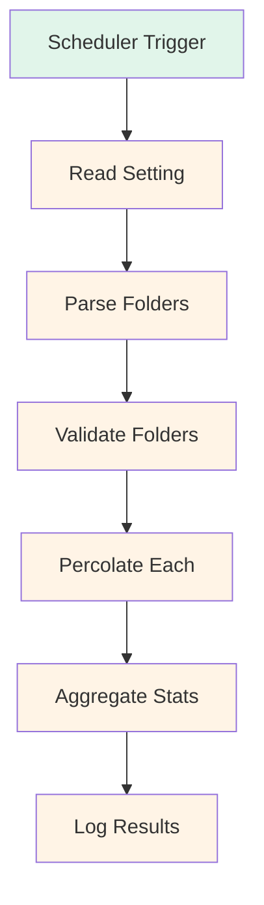

# Configurable Percolation Folders Implementation Plan

## Problem Statement
The batch percolation scheduler currently hardcodes scanning of the `Sessions` folder only. Tasks stored in other folders (e.g., `TN`, `Tasks`) are not being synced to Neo4j, even though the lifecycle module was updated to support multiple folder patterns.

## Solution Overview
Add a configurable `OBSIDIAN_VAULT_SCAN_FOLDERS` environment variable that accepts a comma-separated list of folder names to scan. This provides flexibility while maintaining backward compatibility.

## Architecture



## Implementation Steps

### 1. Add Setting to settings.py
**File**: `omega_kg/settings.py`

Add new field after line 285 (after `ai_conversations_path`):

```python
# --- Percolation Engine Configuration ---
obsidian_vault_scan_folders: str = Field(
    "Sessions",
    validation_alias="OBSIDIAN_VAULT_SCAN_FOLDERS",
    description="Comma-separated list of folder names to scan for percolation (default: Sessions)",
)
```

**Rationale**:
- Positioned near other path-related settings for logical grouping
- Uses Pydantic Field for validation and environment variable support
- Default value maintains backward compatibility
- Clear description explains purpose and format

### 2. Modify PercolationEngine.percolate_from_vault()
**File**: `omega_kg/percolation.py`

Update method signature and implementation (lines 32-68):

```python
def percolate_from_vault(
    self,
    vault_path: Path,
    scan_folders: Optional[List[str]] = None,
) -> Dict[str, int]:
    """
    Percolates tasks, commits, and session/decision links from markdown files in specified folders.

    Parameters:
        vault_path (Path): Root directory of the Obsidian vault to scan.
        scan_folders (Optional[List[str]]): List of folder names to scan.
            If None, uses default from settings.obsidian_vault_scan_folders.

    Returns:
        dict: Counts of processed items with keys "tasks", "commits", and "links".
    """
    # Parse scan folders from settings if not provided
    if scan_folders is None:
        scan_folders_str = settings.obsidian_vault_scan_folders
        scan_folders = [f.strip() for f in scan_folders_str.split(",") if f.strip()]

    stats = {"tasks": 0, "commits": 0, "links": 0}

    for folder_name in scan_folders:
        folder_path = vault_path / folder_name
        if not folder_path.exists():
            logger.warning(f"Percolation folder does not exist: {folder_path}")
            continue

        logger.debug(f"Scanning percolation folder: {folder_path}")

        # Find all markdown files in this folder
        for md_file in folder_path.rglob("*.md"):
            try:
                content = md_file.read_text(encoding="utf-8")
                metadata = self._extract_frontmatter(content)

                if metadata:
                    # Extract and percolate tasks
                    task_count = self._percolate_task(md_file, metadata, content)
                    stats["tasks"] += task_count

                    # Extract and percolate commits
                    commit_count = self._percolate_commits(md_file, metadata, content)
                    stats["commits"] += commit_count

                    # Extract and percolate session data
                    session_count = self._percolate_session(md_file, metadata, content)
                    stats["links"] += session_count

            except Exception as e:
                logger.error(f"Error percolating {md_file}: {e}")

    return stats
```

**Key Changes**:
- Added `scan_folders` parameter with default `None`
- Parse comma-separated list from `settings.obsidian_vault_scan_folders` when not provided
- Iterate through each folder instead of hardcoded single folder
- Added folder existence validation with warning logging
- Added debug logging for each folder being scanned
- Updated docstring to reflect new parameter

### 3. Update batch_percolate_sessions()
**File**: `omega_kg/capture_server.py`

Update function (lines 321-357):

```python
def batch_percolate_sessions():
    """
    Batch percolates all session logs from Obsidian vault to Neo4j.
    Intended to run periodically via scheduler.

    Scans configurable folders defined by OBSIDIAN_VAULT_SCAN_FOLDERS setting.
    """
    driver = None
    try:
        import time

        start_time = time.time()
        logger.info("→ Scheduler execution started: batch_percolate_sessions")

        # Parse scan folders from settings
        scan_folders_str = settings.obsidian_vault_scan_folders
        scan_folders = [f.strip() for f in scan_folders_str.split(",") if f.strip()]

        logger.info(f"Scanning folders: {', '.join(scan_folders)}")

        # Validate each folder exists
        valid_folders = []
        vault_base = Path(settings.obsidian_vault_path)
        for folder_name in scan_folders:
            folder_path = vault_base / folder_name
            if folder_path.exists():
                valid_folders.append(folder_path)
                logger.debug(f"Validated folder: {folder_path}")
            else:
                logger.warning(f"Percolation folder does not exist: {folder_path}")

        if not valid_folders:
            logger.warning("No valid percolation folders found - skipping batch percolation")
            return

        driver = GraphDatabase.driver(
            settings.neo4j_uri, auth=(settings.neo4j_user, settings.neo4j_password)
        )
        engine = PercolationEngine(driver)

        # Percolate each valid folder
        total_stats = {"tasks": 0, "commits": 0, "links": 0}
        for folder_path in valid_folders:
            logger.debug(f"Initiating percolation from: {folder_path}")
            folder_stats = engine.percolate_from_vault(folder_path)
            total_stats["tasks"] += folder_stats["tasks"]
            total_stats["commits"] += folder_stats["commits"]
            total_stats["links"] += folder_stats["links"]

        elapsed_ms = (time.time() - start_time) * 1000
        logger.info(
            f"[OK] Scheduler completed in {elapsed_ms:.0f}ms: "
            f"{len(valid_folders)} folder(s), "
            f"{total_stats['tasks']} tasks, "
            f"{total_stats['commits']} commits, "
            f"{total_stats['links']} decision links"
        )
        logger.debug(f"Stats detail: {total_stats}")
    except Exception as e:
        logger.error(f"Batch session percolation failed: {e}", exc_info=True)
    finally:
        if driver is not None:
            driver.close()
```

**Key Changes**:
- Parse `OBSIDIAN_VAULT_SCAN_FOLDERS` from settings
- Validate each folder exists before scanning
- Aggregate stats across all folders
- Enhanced logging to show number of folders scanned
- Updated completion message to include folder count
- Added debug logging for folder validation

### 4. Configuration Examples

#### Example 1: Default (Backward Compatible)
```bash
# .env file (no setting needed - uses default)
# Result: Scans only 'Sessions' folder
```

#### Example 2: Scan Multiple Folders
```bash
# .env file
OBSIDIAN_VAULT_SCAN_FOLDERS=Sessions,TN,Tasks
# Result: Scans Sessions, TN, and Tasks folders
```

#### Example 3: Scan TN Folder Only
```bash
# .env file
OBSIDIAN_VAULT_SCAN_FOLDERS=TN
# Result: Scans only TN folder
```

#### Example 4: Scan Tasks Folder Only
```bash
# .env file
OBSIDIAN_VAULT_SCAN_FOLDERS=Tasks
# Result: Scans only Tasks folder
```

### 5. Testing Strategy

#### Unit Test
Create test in `tests/test_percolation.py`:

```python
def test_scan_folders_default():
    """Test default behavior scans Sessions folder."""
    # Mock settings with default value
    # Verify only Sessions folder is scanned

def test_scan_folders_custom():
    """Test custom folder list."""
    # Mock settings with "Sessions,TN"
    # Verify both folders are scanned

def test_scan_folders_nonexistent():
    """Test warning when folder doesn't exist."""
    # Mock settings with "NonExistent"
    # Verify warning is logged and folder is skipped

def test_scan_folders_empty_string():
    """Test handling of empty string."""
    # Mock settings with ""
    # Verify defaults to Sessions
```

#### Integration Test
```bash
# Start capture server with custom folders
export OBSIDIAN_VAULT_SCAN_FOLDERS=TN
poetry run capture-server

# Check logs for:
# - "Scanning folders: TN"
# - "Validated folder: /path/to/vault/TN"
# - "[OK] Scheduler completed in Xms: 1 folder(s), Y tasks, Z commits, W decision links"
```

### 6. Documentation Updates

#### Update AGENTS.md
Add to "Project-Specific Patterns" section:

```markdown
### Percolation Scan Folders
- **Configurable folders**: Batch percolation scans folders defined by `OBSIDIAN_VAULT_SCAN_FOLDERS` environment variable (comma-separated, default: "Sessions")
- **Folder validation**: Each folder is validated for existence before scanning; non-existent folders log warnings and are skipped
- **Multi-folder support**: Stats are aggregated across all scanned folders
```

#### Update docs/TROUBLESHOOTING.md
Add troubleshooting section:

```markdown
## Percolation Not Syncing Tasks

### Symptoms
- Log shows "2 tasks" processed but only 1 task node appears in Neo4j
- Tasks exist in `TN` folder but are not being synced

### Causes
- Batch scheduler only scans `Sessions` folder by default
- Tasks stored in other folders (e.g., `TN`, `Tasks`) are not included in percolation

### Solutions

#### Option 1: Use Environment Variable
Set `OBSIDIAN_VAULT_SCAN_FOLDERS` in `.env` file:

```bash
# Scan multiple folders
OBSIDIAN_VAULT_SCAN_FOLDERS=Sessions,TN,Tasks

# Scan only TN folder
OBSIDIAN_VAULT_SCAN_FOLDERS=TN
```

#### Option 2: Move Tasks to Sessions Folder
Move task files from `TN` to `Sessions` folder to leverage existing scanner.

#### Option 3: Use Lifecycle Module
The lifecycle module already supports scanning `TN` folder. Run:

```bash
poetry run omega lifecycle
```

### 7. Migration Notes

- No database migration required (configuration-only change)
- Existing deployments will continue using default `Sessions` folder
- Users must update `.env` to scan additional folders
- Backward compatible: empty or missing setting defaults to `Sessions`
